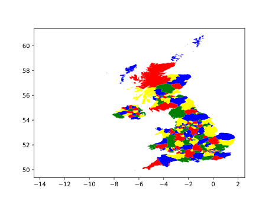

# constraint-satisfaction-solver
Implementation based on pseudocode of the book `Artificial Intelligence: A Modern Approach (3rd edition)`.

# Prerequisites
- Selenium Webdriver [Geckodriver](https://github.com/mozilla/geckodriver/releases), in order to get sudokus from remote sources. To install it:

  ```bash
  $ tar -xvzf geckodriver-vX.YY.Z-linux64.tar.gz # X.YY.Z at current time is 0.21.0
  $ sudo mv geckodriver /usr/local/bin/
  ```

# Compatibilities
- Java: `Java 8`
- Python: `Python 2.7 or 3.5`

## Key elements
- **Sudoku**:
  - Implementation of csp algorithm based on pseudocode of the book `Artificial Intelligence: A Modern Approach (3rd edition)`.
  - Implementation of a utility to download sudoku from a variety of difficulties (`easy`, `medium`, `hard`, `evil`).
- **Map**:
  - Implementation of csp algorithm based on pseudocode of the book `Artificial Intelligence: A Modern Approach (3rd edition)`.
  - Solution of Australian map with static data (**only Java version**).
  - Implementation of a utility that loads geospatial data to paint the result on a real map, using GeoPandas and Matplotlib with GeoJSON data (**only Python version**).

## Version differences
The code written in Java is just a *port* of the python code. Both implement the same functionality except on the Java version, which doesn't make use of geospatial data to display the result on a real map.

# How to install (Java Version)
You must have `gradle` [installed](https://gradle.org/install/) in order to run this version of csp solvers. Once installed, you can run one of these tasks in order to see the results:

```bash
constraint-satisfaction-solver/java/csp$ gradle run_sudoku  # run sudoku example with fixed sudoku boards.
```
```bash
constraint-satisfaction-solver/java/csp$ gradle run_sudoku_scraping  # run sudoku example with dinamic sudokus fetched from "www.websudoku.com"
```
```bash
constraint-satisfaction-solver/java/csp$ gradle run_map  # run map coloring problem for Australia map. 
```

# How to install & Run (Python Version)

```bash
constraint-satisfaction-solver/python/$ pip install -r csp_solver/requirements.txt
```

## Map Configuration
The example is designed to solve the problem of colouring maps on the map of the United Kingdom. In order to change the country, you must find the following code on [example.py](python/csp_solver/src/map/example.py#L20) file:

```python
  input_data = {
        'country': 'united kingdom'.lower(),  # or 'ESP'....
        'key': 'admin'  # ....with 'adm0_a3'
    }
```
and change the `country` key for the desired country. The search for the country, internally, can be solved in two ways:
- Using the `key` key setted as **admin**, which is the full name of the country in **lowercase**.
- Or using the `key` key setted as **adm0_a3**, which is a [ISO 3166 Country Codes (A3)](https://en.wikipedia.org/wiki/ISO_3166-1_alpha-3) shortcut.

## Run
```bash
constraint-satisfaction-solver/python/$ PYTHONPATH=. python csp_solver/src/sudoku/example.py # run sudoku example with fixed sudoku boards.
```
```bash
constraint-satisfaction-solver/python/$ PYTHONPATH=. python csp_solver/src/sudoku/example_scraping.py # run sudoku example with dinamic sudokus fetched from "www.websudoku.com"
```
```bash
constraint-satisfaction-solver/python/$ PYTHONPATH=. python csp_solver/src/map/example.py # run map coloring problem for UK map. 
```

# Screenshots & Outputs
- **Sudoku (Java and Python output are equal):**

| | 1 | 2 | 3 | 4 | 5 | 6 | 7 | 8 | 9 |
| -- | -- | -- | -- | -- | -- | -- | -- | -- | -- |
| **A** | 2 | 1 | 3 | 5 | 9 | 8 | 4 | 7 | 6 | 
| **B** | 7 | 6 | 9 | 4 | 1 | 3 | 8 | 5 | 2 | 
| **C** | 8 | 4 | 5 | 2 | 6 | 7 | 1 | 3 | 9 | 
| **D** | 6 | 2 | 7 | 8 | 3 | 9 | 5 | 1 | 4 | 
| **E** | 9 | 5 | 8 | 1 | 2 | 4 | 7 | 6 | 3 | 
| **F** | 1 | 3 | 4 | 7 | 5 | 6 | 9 | 2 | 8 | 
| **G** | 3 | 9 | 1 | 6 | 8 | 5 | 2 | 4 | 7 | 
| **H** | 4 | 8 | 2 | 3 | 7 | 1 | 6 | 9 | 5 | 
| **I** | 5 | 7 | 6 | 9 | 4 | 2 | 3 | 8 | 1 | 
  
`RAW SUDOKU [Evil]: 003500400000400050000060109020009004908000703100700020301080000080001000006002300 (0,010s)`

- **Australian Map (Java):**

```bash
[Q] = red
[NSW] = blue
[T] = red
[V] = red
[NT] = blue
[WA] = red
[SA] = green
```
- **Dynamic Map (Python):**

<p align="center">
  
</p>
  
# Acknowledgement
- Geospatial data has been downloaded from [Naturalearthdata](https://www.naturalearthdata.com/http//www.naturalearthdata.com/download/10m/cultural/ne_10m_admin_1_states_provinces.zip)
